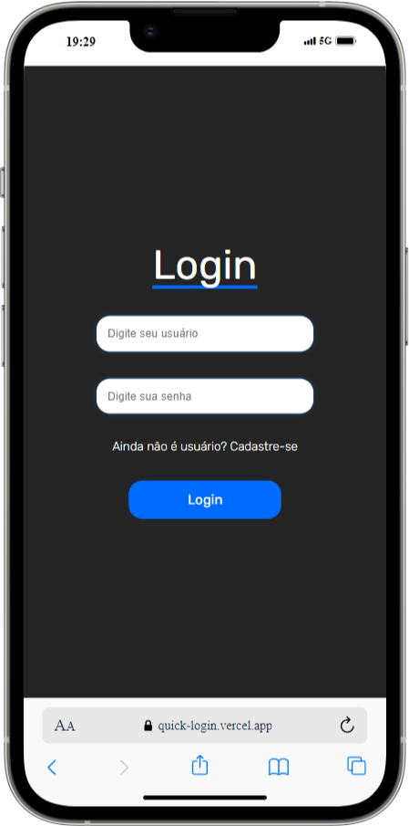

# QuickLogin

**🚀 Veja o projeto na [Vercel](https://quick-login.vercel.app) 🌐**

Este projeto é um sistema de autenticação de usuários, com **cadastro** e **login**. Ele utiliza uma arquitetura **back-end** com `Node.js`, `Express` e `Sequelize` (conectado a um banco de dados MySQL) e um **front-end** desenvolvido com `React`, estilizado com `Styled Components`, e integrado ao back-end para operações de autenticação.

**⚠️ Atenção:** Este projeto é apenas para estudos e aprendizado.

  

## Estrutura do Projeto

O projeto é dividido em duas pastas principais:
- **back-end**: Contém a API REST para gerenciar o banco de dados, autenticação e lógica de negócios.
- **front-end**: Inclui a interface do usuário para cadastro, login e navegação.

### Tecnologias Utilizadas

#### Back-end:
- Node.js
- Express
- Sequelize
- MySQL
- bcrypt (hashing de senhas)
- dotenv (manipulação de variáveis de ambiente)

#### Front-end:
- React
- Styled Components
- React Router DOM
- React Toastify (notificações)

---

## Funcionalidades

### Back-end:
1. **Cadastro de Usuários**:
   - Validações para campos obrigatórios e email válido.
   - Hashing seguro de senhas utilizando `bcrypt`.

2. **Login de Usuários**:
   - Verificação de credenciais (usuário e senha).
   - Retorno de mensagens claras para erros como usuário/senha incorretos.

3. **Exclusão de Usuário**:
   - Permite a exclusão de um usuário específico através do seu **nome de usuário**.

4. **Conexão com Banco de Dados**:
   - Configuração para ambientes de desenvolvimento e produção.

### Front-end:
1. **Formulário de Cadastro**:
   - Inputs validados dinamicamente (ex.: senha repetida e validação de email).
   - Notificação de sucesso ou erros (ex.: username já existente).

2. **Formulário de Login**:
   - Mensagens de erro claras para entradas inválidas ou inexistentes.
   - Redirecionamento para a página principal após login bem-sucedido.

3. **Página Inicial (Home)**:
   - Exibe uma mensagem de boas-vindas personalizada após o login.

---

## Hospedagem

- O **back-end** foi hospedado na **Render**.
- O **banco de dados MySQL** está hospedado no **[db4free.net](https://www.db4free.net/)**.
- O **front-end** está hospedado na **Vercel** e pode ser acessado **[AQUI 🌐](https://quick-login.vercel.app)**.

---

Projeto desenvolvido por Lucas de Mira.